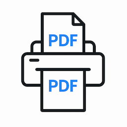

# PDFRendr

[](https://opensource.org/licenses/MIT)

Remove dynamic content from PDFs while preserving visual appearance.

*Built on proven methodologies from Didier Stevens' PDF malware analysis research.*



PDFRendr converts PDF pages to images and rebuilds them into a clean PDF. This removes JavaScript, forms, embedded files, and other dynamic objects while maintaining the exact visual output.

**Key Benefits:**
- Eliminates 17 types of dynamic objects
- Preserves visual appearance exactly  
- Works in browser and Node.js
- Processes files locally (no uploads)

## Installation

```bash
npm install pdfrendr
```

## Usage

### Node.js

```javascript
import { processPDF } from 'pdfrendr';
import fs from 'fs';

const inputPdf = fs.readFileSync('input.pdf');
const result = await processPDF(inputPdf.buffer);

fs.writeFileSync('output.pdf', result.processedPdf);
console.log(`Removed ${result.removedObjects.length} dynamic objects`);
```

### Browser

```html
<script src="pdfrendr.umd.cjs"></script>
<script>
  const { PDFRenderer } = PDFRendr;
  
  // Process PDF file
  const result = await new PDFRenderer().render(pdfArrayBuffer);
  
  // Download cleaned PDF
  const blob = new Blob([result.processedPdf], { type: 'application/pdf' });
  const url = URL.createObjectURL(blob);
  const a = document.createElement('a');
  a.href = url;
  a.download = 'cleaned.pdf';
  a.click();
</script>
```

## Configuration

```javascript
const result = await processPDF(pdfBuffer, {
  renderQuality: 2.0,      // Image quality: 1.0-4.0 (higher = better quality)
  compressionLevel: 2,     // Compression: 0-3 (higher = smaller file)
  timeoutMs: 30000        // Timeout in milliseconds
});
```

### Response

```javascript
{
  processedPdf: ArrayBuffer,        // Clean PDF data
  removedObjects: Array,            // Detected dynamic objects
  originalSize: number,             // Original file size  
  processedSize: number,            // New file size
  processingTimeMs: number          // Processing time
}
```

## What Gets Removed

PDFRendr detects and removes 17 types of dynamic objects using Didier Stevens' proven detection methodology:

**JavaScript & Actions**
- JavaScript code (`/JavaScript`, `/JS`)
- Form submissions (`/SubmitForm`) 
- External links (`/URI`)
- Navigation actions (`/GoTo`, `/Launch`, `/Named`)

**Files & Media**
- Embedded files (`/EmbeddedFile`, `/Filespec`)
- Rich media content (`/RichMedia`, `/Sound`, `/Movie`)

**Interactive Features**
- Form fields and triggers (`/AA`, `/A`, `/XFA`)
- Digital signatures (`/Sig`, `/ByteRange`)
- Custom fonts (`/Type1`, `/CFF`, `/TrueType`)

## Examples

Complete examples in the `examples/` directory:
- **`examples/client.html`** - Drag & drop browser interface
- **`examples/node-cli.cjs`** - Command line tool
- **`examples/server.js`** - HTTP API server

## Research & References

PDFRendr implements techniques and methodologies from:

**Didier Stevens** - PDF malware analysis pioneer
- [PDF Tools](https://blog.didierstevens.com/programs/pdf-tools/) - PDFiD and pdf-parser methodologies
- [PDF Analysis Research](https://blog.didierstevens.com/) - PDF structure analysis and threat detection
- Name obfuscation detection and false positive prevention techniques

**Intezer** - [PDF Malware Analysis](https://www.intezer.com/blog/malware-analysis/analyzing-malicious-pdf-files/) - Modern threat analysis

## License

MIT License - see [LICENSE](LICENSE) file.

---

**Demo:** https://pdfrendr.github.io  
**Built with:** [PDF.js](https://mozilla.github.io/pdf.js/) and [PDF-lib](https://pdf-lib.js.org/)